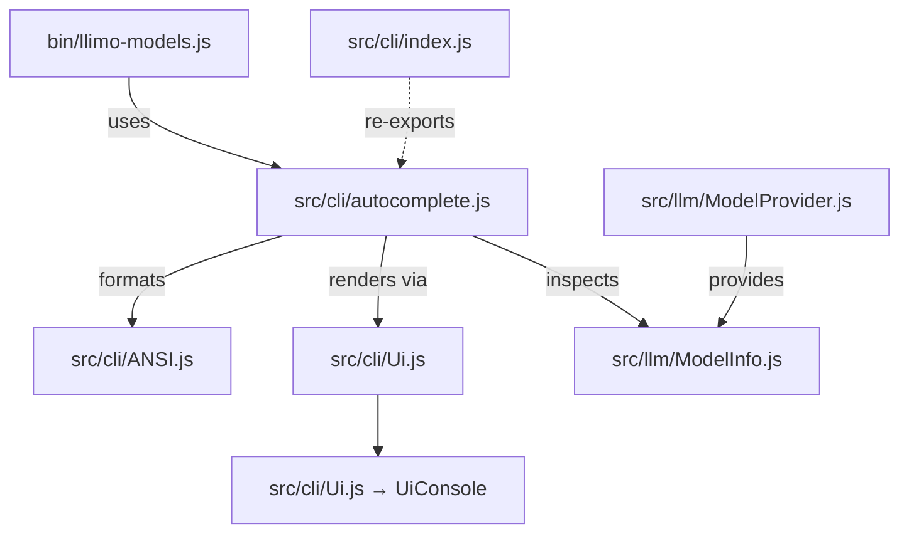

# CLI Autocomplete usage map

## Circular dependency constraint
`src/cli/autocomplete.js` now talks directly to `Ui` and `ANSI` instead of cycling through `src/cli/index.js`. The exported `autocompleteModels` bag of helpers keeps `bin/llimo-models.js` in sync with the interactive table without dragging the entire CLI index into the dependency graph.

## Flow overview
- `bin/llimo-models.js` loads `autocompleteModels` to print data in pipe mode or to run the interactive picker.
- `autocompleteModels` relies on `src/cli/Ui.js` for rendering/output and `src/cli/ANSI.js` for colouring, while reading model data from the LLM layer (`ModelInfo`, `ModelProvider`, etc.).
- The LLM side never imports anything from the CLI bundle, so the dependency edges stay one-way.

## Architecture diagram

